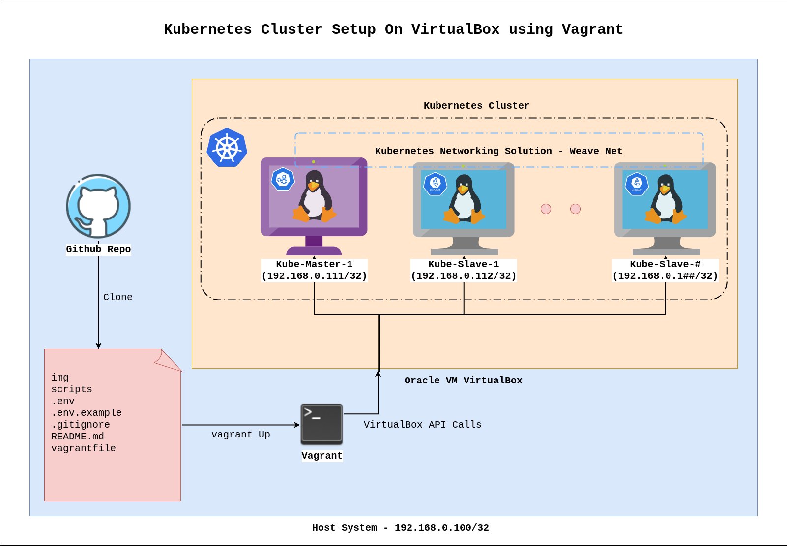

# Kubernetes Cluster Setup On VM using Vagrant
We are going to setup kubernetes cluster on VM using Vagrant.

## Project System Requirements

- **System RAM** : 8 GB
- **System CPU** : 4 Cores
- **System Disk** : 20 GB(Free)
- **System OS** : Debian-Based Any OS(Tested on Ubuntu 20.04)

## Pre-Requisites

- Installed VirtualBox - (Ref for Installation : https://www.virtualbox.org/wiki/Linux_Downloads)
- Installed Vagrant - (Ref for Installation : https://www.vagrantup.com/downloads)

## Project Overview 

- Base Image : ubuntu/focal64
- CRI-O Version : Latest(1.25.0)
- Kubeadm Version : Latest(v1.25.0)
- Kubectl Version : Latest(v1.25.0)
- kubelet Version : Latest(v1.25.0)
- CNI : Weave Net(Latest)

## Project Architecture 



| Hostname        | Componets           | 
| ------------- |:-------------:| 
| kube-master      | kube-apiserver, kube-controller-manager, kube-scheduler, etcd, kubelet, docker, weave net | 
| kube-worker-1      | kubelet, kube-proxy docker, weave net      |  
| kube-worker-n | kubelet, kube-proxy docker, weave net      | 

## Before Start

- Installation of require Vagrant plugins

```bash
vagrant plugin install vagrant-env vagrant-vbguest
```

- Clone the project and change directory to it.

```bash
git clone https://github.com/akshayithape-devops/Kubernetes-Setup-Using-Vagrant.git && cd Kubernetes-Setup-Using-Vagrant
```

- Customize your own environment file.

```bash
cp .env_example .env
```

- Notes for env file modification 

``` 
1. We have to set bridge interface name in .env file.(You can use `ifconfig` or `ip` command to find interface name.)
2. As we used bridge, we have to assign the IP address to master & workers in same range of host system.
3. In .env file, You can define how many worker node is required.
4. In .env file, You can define memory and CPU requirement for master and workers.
```

## Start the Project 

- Start the Master and Worker nodes using `vagrant up` command.

```bash
# It will take around 25-30 mins to provisioning 3 VMs(1 Master & 2 Workers)
vagrant up 
```

- Check the status of vagrant 

```bash
vagrant status
```

- To connect Master & Worker Nodes using `vagrant ssh` command.

```bash
# To connect Master Node
vagrant ssh kube-master

# To connect Worker Nodes
# You have to replace n with worker node number.
vagrant ssh kube-worker-n
```

- To check all nodes are available in kubernetes cluster

```bash
# To connect Master Node
vagrant ssh kube-master

# On kube-master Node
kubectl get nodes
```

## Common vagrant Commands

- To provision the project

```bash
vagrant provision
```

- To stop the running project 

```bash
vagrant suspend
```

- To shutdown the running project 

```bash
vagrant halt
```

- To restart the running project 

```bash
vagrant up
```

- To delete the project 

```bash
vagrant destroy -f
```
